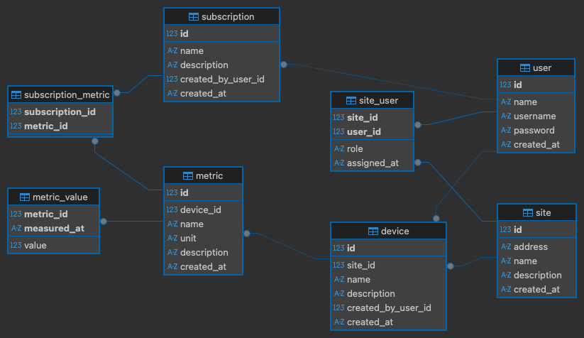

# Energy Management System

## Installation and usage

Run `docker-compose up` - it should work! The API will be accessible at http://127.0.0.1:8000. See API documentation at http://127.0.0.1:8000/docs 

**Note**: You must include `X-User-ID` header in most requests (not for `/metrics`). Payload format is mentioned in the docs (Endpoint > Request body).

**Insert sample data** with: `docker-compose run app uv run -m energy_manager.db.insert_sample_data`

Check the **SQLite database** in `/energy.db`.

Run **tests** with `docker-compose run app uv run pytest`. Tests use local SQLite DB file named `energy_test.db` which is recreated on each run with sample data.

### Run with venv

I used [uv](https://docs.astral.sh/uv/) package manager to handle dependencies.

After you install the tool, just run `uv sync` which will create venv.

Then you can use `uv run` to execute a python script or module.

## Development

Please install [pre-commit](https://pre-commit.com/) tool: `pip install pre-commit` (or `uv tool install pre-commit`)

Then install hooks defined in `.pre-commit-config.yaml` via `pre-commmit install`.

When you commit, your code will be checked by linter and then formatted (by [ruff](https://docs.astral.sh/ruff/)).

You can also run the hooks manually for all files with `pre-commit run --all-files`. 

## Description

I started with DB design and created SQLAlchemy models. Then I thought about API endpoints and started working with FastAPI to achieve the desired results.

I used SQLite for easier development and debugging. I used FastAPI because I worked with it before. I used uv package manager because I wanted to try something new.

I used [Repository](./energy_manager/db/repositories.py) class for DB access and main logic. This way, API routers don't contain too much code and I can use some common code (e.g. for user access).

I added a lot of tests to properly test the API. When testing create and update, I checked only API response, not data in DB. But since I tried it also manually before and it works (data is added), should be fine.

ERD for database:

### Possible improvements
* Add `device_type` table, so we have general device types.
* Add `relationship()` to SQL models (but honestly I don't like it, but it's good for cascade delete).
* Add `device_metric` table, so we can have general metric types in `metric` table.
* Instead of `X-User-ID` header use JWT token with `user_id` encrypted in it.
* Add user access check for `metrics` endpoints (I removed it to simplify development).
* DI using FastAPI `Depends()` doesn't allow db_url argument - rework it to make it more explicit (e.g. using [this library](https://python-dependency-injector.ets-labs.org/)).
* Add endpoint to read values from metric subscription.
* Dockerfile: Use non-root user for better security (I couldn't make it work with `uv`).
* Tests: use in-memory SQLite or cleanup DB file after test run. Advantage is that now you can open DB file and check data.
